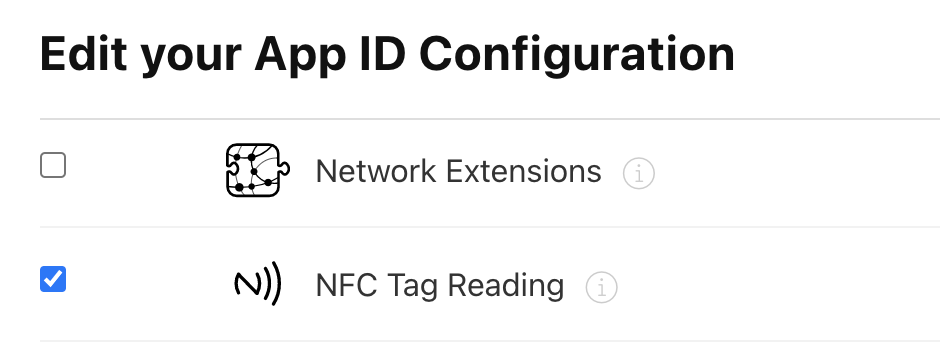
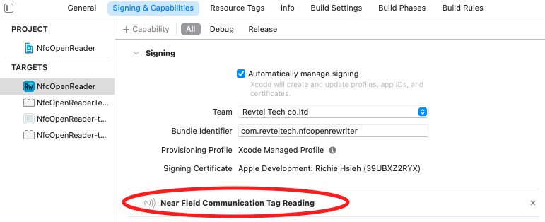
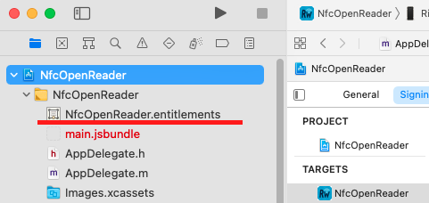
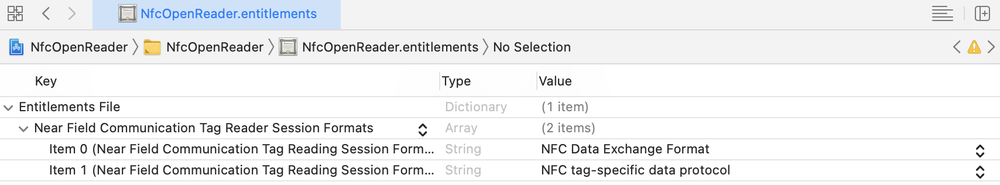

# react-native-read-nfc-passport

Read data from NFC passport, Vietnam CCCD for iOS and Android, reference from `NFCPassportReader` and `jmrtd`

## Installation

```sh
npm install react-native-read-nfc-passport
```

```sh
yarn add react-native-read-nfc-passport
```

## Configuration

### IOS

1. In [apple developer site](https://developer.apple.com/), enable capability for NFC



2. in Xcode, add `NFCReaderUsageDescription` into your `info.plist`, for example:

```
<key>NFCReaderUsageDescription</key>
<string>We need to use NFC</string>
```

More info on Apple's [doc](https://developer.apple.com/documentation/bundleresources/information_property_list/nfcreaderusagedescription?language=objc)

Additionally, if writing ISO7816 tags add application identifiers (aid) into your `info.plist` as needed like this.
```
<key>com.apple.developer.nfc.readersession.iso7816.select-identifiers</key>
<array>
  <string>A000000151000000</string>
  <string>D2760000850100</string>
  <string>D2760000850101</string>
</array>
```

3. in Xcode's `Signing & Capabilities` tab, make sure `Near Field Communication Tag Reading` capability had been added, like this:



If this is the first time you toggle the capabilities, the Xcode will generate a `<your-project>.entitlement` file for you:



4. in Xcode, review the generated entitlement. It should look like this:



More info on Apple's [doc](https://developer.apple.com/documentation/bundleresources/entitlements/com_apple_developer_nfc_readersession_formats?language=objc)

5. PassiveAuthentication
Add file masterList.pem to `Project`

Passive Authentication is now part of the main library and can be used to ensure that an E-Passport is valid and hasn't been tampered with.

It requires a set of CSCA certificates in PEM format from a master list (either from a country that publishes their master list, or the ICAO PKD repository). See the scripts folder for details on how to get and create this file.

**The masterList.pem file included in the Sample app is purely there to ensure no compiler warnings and contains only a single PEM file that was self-generated and won't be able to verify anything!**

### Android

Simple add `uses-permission` into your `AndroidManifest.xml`:

```xml
 <uses-permission android:name="android.permission.NFC" />
```

## Usage

```js
import { scanNfc } from 'react-native-read-nfc-passport';

// documentNumber: Last 9 digits of cccd
// dateOfBirth: yymmdd
// dateOfExpiry: yymmdd

const onReadNfc = async () => {
  try {
    const data = await scanNfc({
      documentNumber: 'xxxxxxxxx',
      dateOfBirth: 'xxxxxx',
      dateOfExpiry: 'xxxxxx',
    });
    console.log('onReadNfc', data);
  } catch (error) {
    console.log(err);
  }
};
```

## Sample app
There is a sample app included in the repo which demonstrates the functionality.

## License

MIT

---
